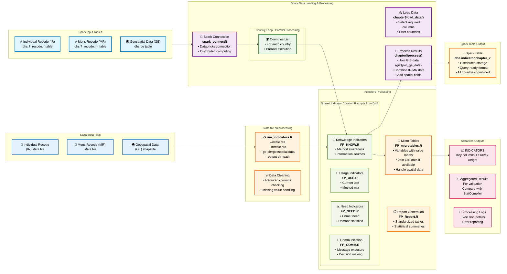

# DHS Chapter 7 Indicator Workflow

```mermaid
graph LR
    %% Input alignment row
    subgraph INPUT_ROW [" "]
        subgraph SPARK_INPUTS [" Spark Input Tables "]
            direction TB
            IR_SPARK["⚡ Individual Recode (IR)<br/>dhs.7_recode.ir table"]
            MR_SPARK["⚡ Mens Recode (MR)<br/>dhs.7_recode.mr table"]
            GE_SPARK["🌍 Geospatial Data (GE)<br/>dhs.ge table"]
        end

        subgraph STATA_INPUTS [" Stata Input Files "]
            direction TB
            IR["👩 Individual Recode (IR) stata file"]
            MR["👨 Mens Recode (MR) stata file"]
            GE_FILE["🌍 Geospatial Data (GE) shapefile<br/>"]
        end
    end
    
    subgraph "Stata file preprocessing"
        PARAM["⚙️ <b>run_indicators.R</b><br/>--ir=file.dta<br/>--mr=file.dta<br/>--ge-dir=geospatial data<br/>--output-dir=path"]
        VALIDATE["✅ Data Cleaning<br/>• Required columns checking<br/>• Missing value handling"]
    end
    
    subgraph "Indicators Processing"
         SPACER2["<br/><br/><br/><br/><br/><br/>"]

        subgraph "Shared Indicator Creation R scripts from DHS"
            SPACER3["<br/><br/><br/>"]
            KNOW["🧠 Knowledge Indicators<br/><b>FP_KNOW.R</b><br/>• Method awareness<br/>• Information sources"]
            USE["💊 Usage Indicators<br/><b>FP_USE.R</b><br/>• Current use<br/>• Method mix"]
            NEED["📊 Need Indicators<br/><b>FP_NEED.R</b><br/>• Unmet need<br/>• Demand satisfied"]
            COMM["📢 Communication<br/><b>FP_COMM.R</b><br/>• Message exposure<br/>• Decision making"]
        end
        
        MICRO["💾 Micro Tables<br/><b>FP_microtables.R</b><br/>• Variables with value labels<br/>• Join GIS data if available<br/>• Handle spatial data"]
        REPORT["📋 Report Generation<br/><b>FP_Report.R</b><br/>• Standardized tables<br/>• Statistical summaries"]
    end
    
    subgraph "Stata files Outputs"
        INDICATORS["📈 INDICATORS<br/>Key columns + Survey weight"]
        PDF["📄 Aggregated Results<br/>For validation<br/>Compare with StatCompiler"]
        LOG["📝 Processing Logs<br/>Execution details<br/>Error reporting"]
    end
    
    subgraph "Spark Data Loading & Processing"
        SC["🔌 Spark Connection<br/><b>spark_connect()</b><br/>• Databricks connection<br/>• Distributed computing"]
        LOAD["📥 Load Data<br/><b>chapter$load_data()</b><br/>• Select required columns<br/>• Filter countries<br/>"]
        
        subgraph "Country Loop - Parallel Processing"
            COUNTRIES["🌍 Countries List<br/>• For each country<br/>• Parallel execution"]
        end
        
        PROCESS["🔄 Process Results<br/><b>chapter$process()</b><br/>• Join GIS data (gis$join_ge_data)<br/>• Combine IR/MR data<br/>• Add spatial fields"]
    end
    
    subgraph "Spark Table Output"
        SPARK_TABLE["⚡ Spark Table<br/><b>dhs.indicator.chapter_7</b><br/>• Distributed storage<br/>• Query-ready format<br/>• All countries combined"]
    end
    
    %% Simplified Subgraph-level Flow
    %% Stata Workflow (top path)
    STATA_INPUTS --> PARAM
    PARAM --> KNOW
    KNOW --> MICRO
    MICRO --> INDICATORS
    
    %% Spark Workflow (bottom path)  
    SPARK_INPUTS --> SC
    SC --> COUNTRIES
    COUNTRIES --> KNOW
    KNOW --> PROCESS
    PROCESS --> SPARK_TABLE
    
    %% Styling
    classDef stataInput fill:#e3f2fd,stroke:#1565c0,stroke-width:2px,color:#000,font-size:18px
    classDef stataProcessing fill:#fff3e0,stroke:#ef6c00,stroke-width:2px,color:#000,font-size:18px
    classDef stataIndicators fill:#f1f8e9,stroke:#558b2f,stroke-width:2px,color:#000,font-size:18px
    classDef stataOutputs fill:#fce4ec,stroke:#c2185b,stroke-width:2px,color:#000,font-size:18px
    
    classDef sparkInput fill:#e1f5fe,stroke:#0277bd,stroke-width:3px,color:#000,font-size:18px
    classDef sparkProcessing fill:#f3e5f5,stroke:#7b1fa2,stroke-width:3px,color:#000,font-size:18px
    classDef sparkIndicators fill:#e8f5e8,stroke:#2e7d32,stroke-width:3px,color:#000,font-size:18px
    classDef sparkOutputs fill:#fff8e1,stroke:#f57f17,stroke-width:3px,color:#000,font-size:18px
    
    classDef invisible fill:transparent,stroke:transparent,color:transparent
    
    %% Original Stata workflow styling
    class IR,MR,GE_FILE stataInput
    class PARAM,VALIDATE,MICRO,REPORT stataProcessing
    class INDICATORS,PDF,LOG stataOutputs
    
    %% Spark workflow styling
    class IR_SPARK,MR_SPARK,GE_SPARK sparkInput
    class SC,LOAD,PROCESS sparkProcessing
    class COUNTRIES sparkIndicators
    class SPARK_TABLE sparkOutputs
    
    %% Shared indicator scripts styling (neutral color to show they're shared)
    class KNOW,USE,NEED,COMM stataIndicators
    
    class SPACER2,SPACER3,INPUT_ROW invisible
```